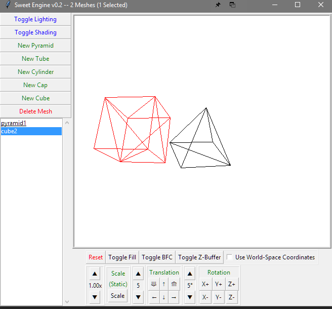
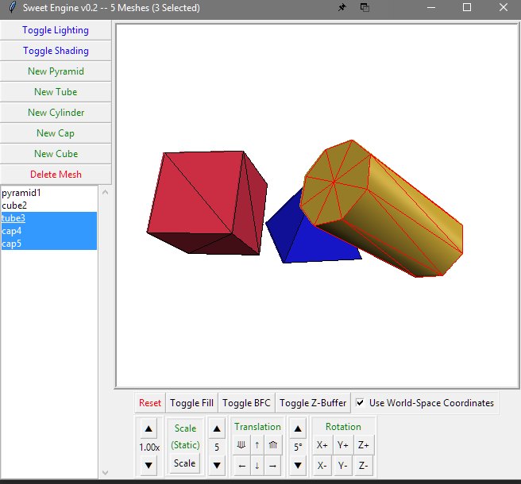
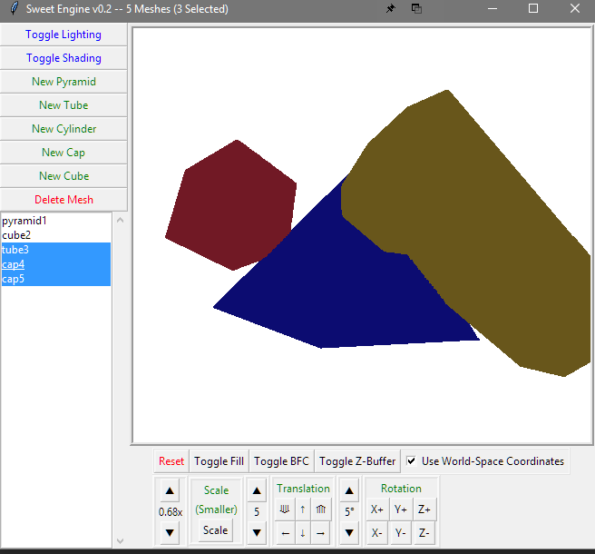
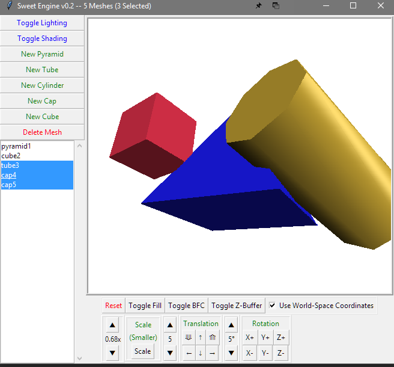
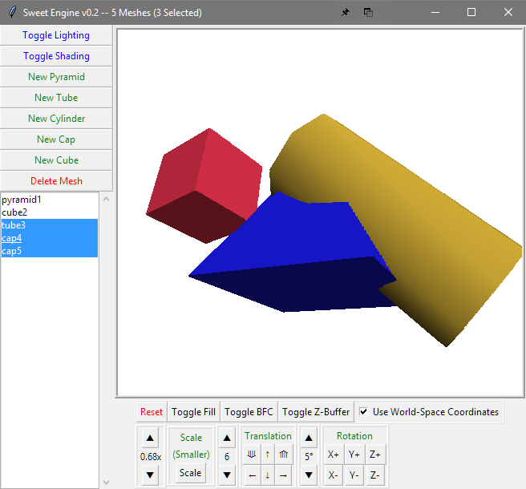
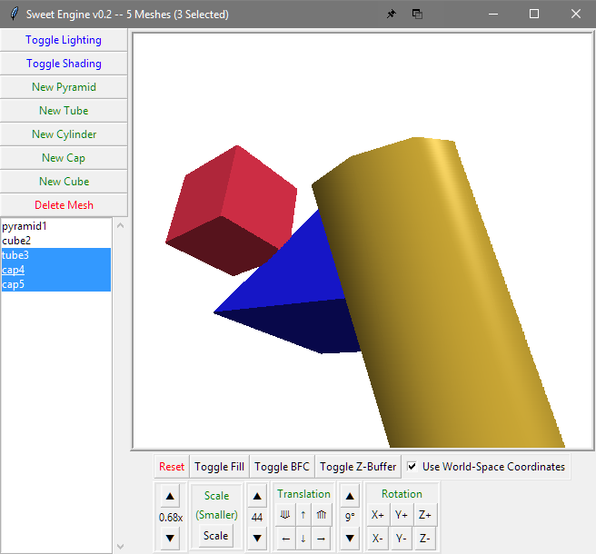

# Graphics Engine
Simple graphics engine that renders various 3D abjects and applies Phong and Gouraud lighting and shading models and allows the manipulation of them (rotation, translation, and scaling). Features backface culling, multiple object selection (and manipulation), Z-buffering, linearly-interpolated triangle filling, shading, and lighting. It provides a GUI for doing all of this via TKinter.

*This school project required the used of TKinter and nothing else. Even use of numpy was forbidden. Every pixel was required to be a rectangle object scaled to as small as possible on a canvas, and matrix manipulation and linear alegbra were done manually. As such, this program is nearly exponentially slower the more "pixels" are being rendered. I wish it wasn't so, but it is what it is.*

         

Ryan Walters

  Louisiana Tech University
  
  2/11/17

  Assignment 4:
  This program draws three dimensional objects and manipulates them,
  projecting results into a 2d plane so that it is viewable on a screen. It shades them using a lighting model that
  includes faceted, gouraud, and phong shading with ambient diffuse, point diffuse, and specular highlights.

  Currently can scale, rotate, and translate objects. All of which
  can be done at different magnitudes.

  It can have multiple objects on screen, with multiple objects being able to be selected at once.
  It can perform manipulations both in place and from origin by toggling the use of world-space coordinates.
  User can create, delete, manipulate and select any number of objects.
  There are currently pyramids and cubes implemented.

  You can toggle culling of backfaces, as well as the filling in of polygons. Polygons are filled in pixel by pixel
  and can occlude background objects by using a z buffer
